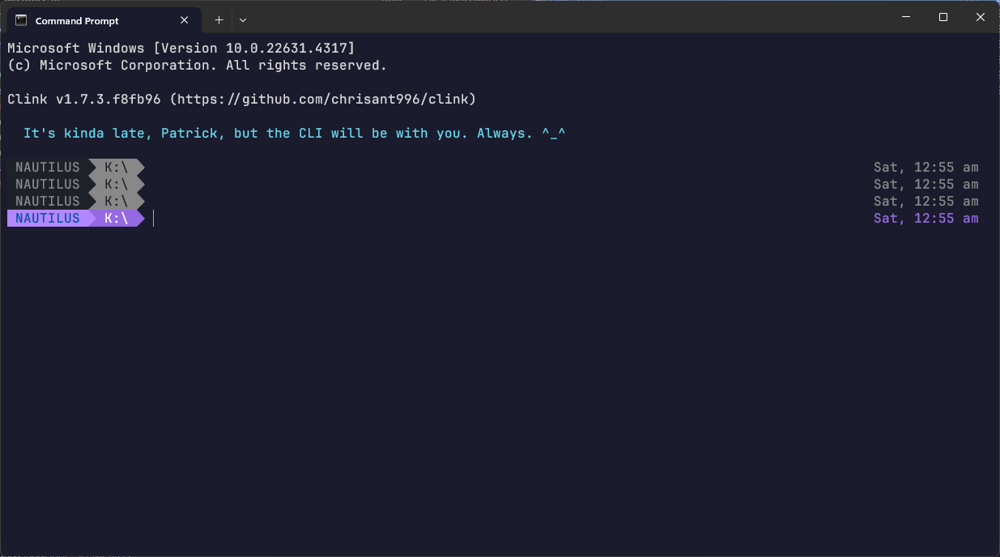

# Custom Prompts

<!-- BEGIN TEMPLATE --- Copy the following and fill it in ---

## Your Custom Prompt Name

Describe your custom prompt.

Give a link to the custom prompt you've added -- be sure to make it a relative link, e.g. [My Prompt](#my_prompt.clinkprompt).

Optionally include a link to a separate main repo for the custom prompt, if you have one.

Recommended:  Add a screen shot of the custom prompt, for example after running `clink config prompt show YourCustomPrompt`.

--- END TEMPLATE --->

## DeepWave

This prompt module is a simple one. While it draws inspiration from a number of other prompts, it is primarily Windows-first, and not a *nix port. It is for power users of the command line (that's why we use `clink`) who see the venerable `C:\>` as its own unique shell *identity* **^_^**.

Though it is simple, it includes various options such as displaying timestamps, computer names, muting of previous prompts, error indicators, single/two-line prompts and a few different background/no-background theme colours - all of which can be enabled/disabled on-the-fly with simple environment variables.

1. Download the [DeepWave.clinkprompt](DeepWave.clinkprompt) file to your [clink theme](https://chrisant996.github.io/clink/clink.html#custom-prompts) folder
2. Activate the prompt with `clink config prompt use DeepWave` 
3. Explore all the options and see more screenshots at [https://github.com/starfishpatkhoo/deepwave-clinkprompt/](https://github.com/starfishpatkhoo/deepwave-clinkprompt/), and configure to suit your tastes and Windows environments
